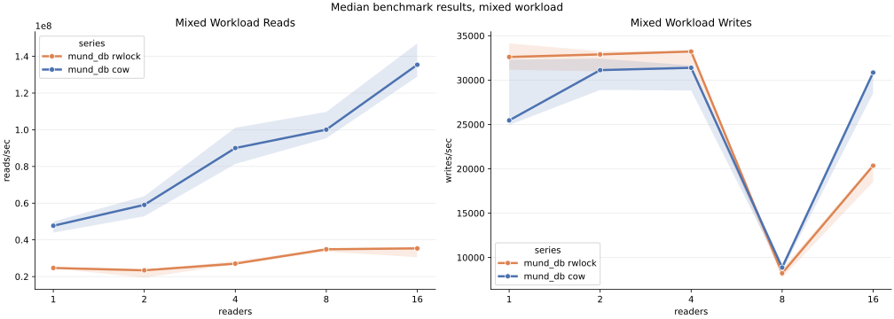
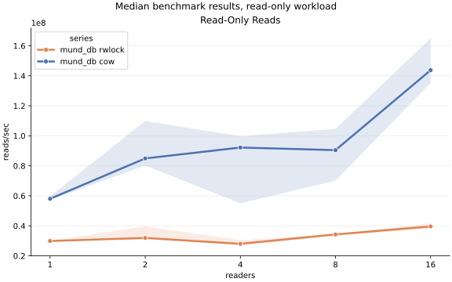

# mund_db

`mund_db` is a small persistent key-value store with:

- a single dedicated writer thread
- concurrent readers
- an in-memory hashmap rebuilt from a WAL on startup
- two selectable backends: `rwlock` and `cow`
- a CLI, REPL, tests, and a simple benchmark

## Layout

- `src/main.zig`: thin entrypoint
- `src/cli.zig`: CLI commands and REPL
- `src/bench.zig`: benchmark runner
- `src/db.zig`: backend selector and shared `KvDb` wrapper
- `src/db_rwlock.zig`: baseline sharded RW-lock backend
- `src/db_cow.zig`: copy-on-write snapshot backend
- `src/wal.zig`: WAL encoding/decoding and checksums
- `src/types.zig`: shared record types and constants

## Architecture

```text
                         scaling view

readers scale out horizontally                     writes stay serialized

reader 1 ----\
reader 2 -----+--> hash(key) --> shard[0..63] --> backend read path --> in-memory state
reader 3 -----+                                              |
...           +                                              +--> `rwlock`: shared shard lock
reader N ----/                                               |
                                                             +--> `cow`: pinned immutable snapshot

writer clients --> write queue --> 1 writer thread --> append + fsync WAL --> mutate shard
```

## WAL format

Each record is binary and little-endian:

```text
+------------+---------+-----------+-------------+------------+-------+---------+
| magic u32  | op u8   | key_len   | value_len   | crc32 u32  | key   | value   |
+------------+---------+-----------+-------------+------------+-------+---------+
```

Field details:

- `magic`: fixed record marker `0x4d4b5631` (`"MKV1"`)
- `op`: `1 = put`, `2 = delete`
- `key_len`: key byte length
- `value_len`: value byte length
- `crc32`: checksum over `op`, `key_len`, `value_len`, `key`, and `value`
- `key`: raw key bytes
- `value`: raw value bytes, empty for `delete`

Replay behavior:

- the WAL is scanned from the beginning on startup
- valid records rebuild the in-memory shards
- a truncated tail record is ignored
- a bad magic or checksum is treated as corruption

## Concurrency model

Readers never touch the WAL. They hash the key and only touch one shard.

Backend choices:

- `rwlock`: each shard is a mutable hashmap behind a shared/exclusive lock
- `cow`: each shard publishes immutable snapshots so readers avoid shard locks

Writes are serialized by a background writer thread. Each write:

1. enters the queue
2. gets appended to the WAL and synced
3. updates the target shard in memory with the selected backend
4. wakes the caller

That keeps acknowledged writes durable and consistent with crash recovery.

## Build and test

```bash
ZIG_GLOBAL_CACHE_DIR=/private/tmp/zig-cache ZIG_LOCAL_CACHE_DIR=.zig-cache zig build test
```

Tests live in [src/db_test.zig](src/db_test.zig).

## CLI

Set the WAL path once:

```bash
export MUND_DB_WAL=data.wal
export MUND_DB_BACKEND=rwlock   # or cow
```

Then use the CLI:

```bash
zig build run -- put hello world
zig build run -- get hello
zig build run -- delete hello
zig build run -- list
zig build run -- repl
```

## Benchmark

There are two useful benchmark modes:

- `bench` / `bench-scale`: one synchronous writer client plus `n` reader clients
- `bench-read` / `bench-read-scale`: readers only, no writer pressure

```bash
export MUND_DB_WAL=bench.wal
export MUND_DB_BACKEND=cow
zig build run -- bench 5 8 4096
zig build run -- bench-scale 3 1024 1 2 4 8 16
zig build run -- bench-read-scale 3 1024 1 2 4 8 16

python3 -m venv /private/tmp/mund_db_venv
/private/tmp/mund_db_venv/bin/pip install seaborn pandas matplotlib
/private/tmp/mund_db_venv/bin/python scripts/plot_bench.py
```

Arguments:

- `5`: seconds
- `8`: reader threads
- `4096`: keyspace size

Current mixed scaling comparison:

```text
rwlock, mixed, 3s, keyspace=1024
readers | reads/sec | writes/sec
1       | 26164459  | 32775
2       | 19389437  | 29455
4       | 25857619  | 30806
8       | 33119237  |  6681
16      | 37310442  | 25275

cow, mixed, 3s, keyspace=1024
readers | reads/sec | writes/sec
1       |  50751729 | 31628
2       |  51854376 | 28788
4       | 105202139 | 29303
8       |  94967858 |  9768
16      | 131045194 | 28239
```

Current read-only scaling comparison:

```text
rwlock, read_only, 3s, keyspace=1024
readers | reads/sec
1       | 30269270
2       | 36240243
4       | 28465457
8       | 32033749
16      | 39374694

cow, read_only, 3s, keyspace=1024
readers | reads/sec
1       |  59987189
2       | 102221856
4       |  90633360
8       |  78816760
16      | 140649071
```

Takeaway:

- `cow` is materially faster than `rwlock` for the current benchmark harness
- `cow` gives much higher read throughput under both read-only and mixed load
- writes are still serialized by design, so write throughput does not scale horizontally

Mixed workload graph:



Read-only graph:



Benchmark machine:

```text
macOS 15.6.1
arm64
Darwin kernel RELEASE_ARM64_T6020
```
